<!--
  Profile README for SanketYerwadkar.
  Keep /assets, /tools and /.github next to this file.
  To change any text inside the graphics (projects, headline, timeline), edit tools/build_assets.py
  and run:  python tools/build_assets.py
-->

  

  I build production-oriented applications using Angular, .NET and TypeScript, 
  while exploring Android development, real-time systems and privacy-focused products.

  
  
  
  

 

  

  

  

  

  

  

  

  

  

 

## Featured Projects

<table>
  <tr>
    <td width="50%"><a href="https://github.com/SanketYerwadkar/IncognitoHub-Android"></a></td>
    <td width="50%"><a href="https://github.com/SanketYerwadkar/SignalX-5G"></a></td>
  </tr>
  <tr>
    <td width="50%"><a href="https://github.com/SanketYerwadkar/Rewindr"></a></td>
    <td width="50%"><a href="https://github.com/SanketYerwadkar/Jobfusion"></a></td>
  </tr>
  <tr>
    <td width="50%"><a href="https://github.com/SanketYerwadkar/Angular-DotNet-Calculator"></a></td>
    <td width="50%"><a href="https://github.com/SanketYerwadkar/sanket-yerwadkar-portfolio"></a></td>
  </tr>
</table>

## Currently Building


## Engineering Focus

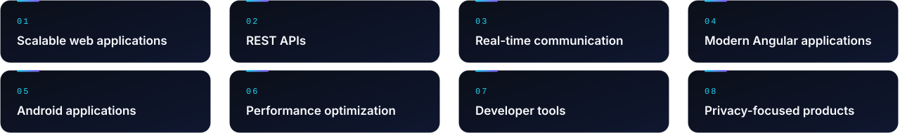

## GitHub Activity

<!--
  The snake is generated from your real contribution graph by .github/workflows/snake.yml.
  It only appears after the workflow has run once: Actions tab -> "Generate Snake" -> Run workflow.
-->

  <picture>
    <source media="(prefers-color-scheme: dark)" srcset="https://raw.githubusercontent.com/SanketYerwadkar/SanketYerwadkar/output/github-snake-dark.svg">
    
  </picture>

  
  

## Developer Journey


 

  

  
  
  
  

