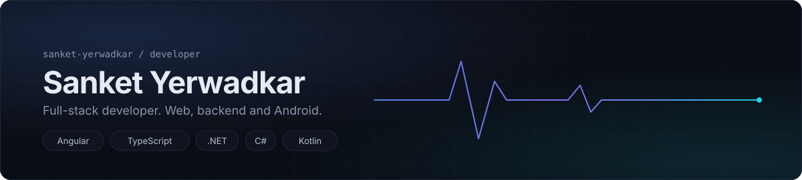
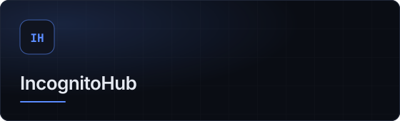
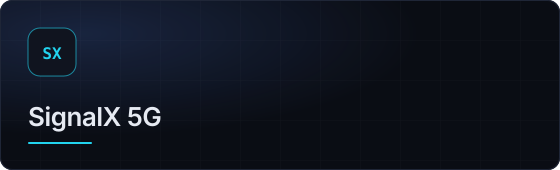
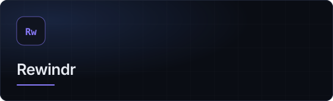
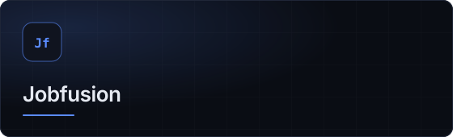
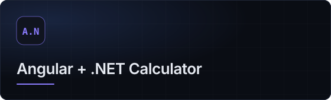
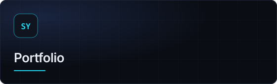

<!-- Profile README for SanketYerwadkar. Keep the assets/ folder next to this file. -->

  

# Hi, I'm Sanket Yerwadkar

**Full-stack developer building modern web, backend and Android applications.**

I build production-oriented applications with Angular, .NET and TypeScript, and I explore Android development, real-time systems and privacy-focused products.
Based in Kolhapur, Maharashtra, India.

  

## Tech stack

<table>
<tr><td width="110"><b>Frontend</b></td><td>      </td></tr>
<tr><td width="110"><b>Backend</b></td><td>     </td></tr>
<tr><td width="110"><b>Database</b></td><td>  </td></tr>
<tr><td width="110"><b>Mobile</b></td><td> </td></tr>
<tr><td width="110"><b>Tools</b></td><td>    </td></tr>
</table>

## Featured projects

<table>
<tr>
<td width="50%" valign="top">

 <b>IncognitoHub</b> &nbsp; 
 Privacy-first Android messaging app with secure pairing, real-time communication and P2P.
    
  
</td>
<td width="50%" valign="top">

 <b>SignalX 5G</b> &nbsp; 
 Android network utility for viewing mobile network and 5G status, with quick access to system network settings.
    
  
</td>
</tr>
<tr>
<td width="50%" valign="top">

 <b>Rewindr</b> &nbsp; 
 A modern video player with timestamp markers, quick navigation and a clean viewing experience.
    
  
</td>
<td width="50%" valign="top">

 <b>Jobfusion</b> &nbsp; 
 Full-stack job discovery platform connecting talent with career opportunities.
    
  
</td>
</tr>
<tr>
<td width="50%" valign="top">

 <b>Angular + .NET Calculator</b> &nbsp; 
 Calculator with an Angular front end and a .NET backend.
    
  
</td>
<td width="50%" valign="top">

 <b>Portfolio</b> &nbsp; 
 My personal developer portfolio.
    
   
</td>
</tr>
</table>

## Currently building

<table>
<tr>
<td width="50%" valign="top"><b>IncognitoHub</b> &nbsp;  Privacy-focused communication features for Android: connect through temporary tokens, without sharing a phone number or email.</td>
<td width="50%" valign="top"><b>SignalX 5G</b> &nbsp;  Android networking and device capabilities: reading network status and linking to system settings.</td>
</tr>
</table>

## Engineering focus

<table>
<tr>
<td width="25%" valign="top"><b>Scalable web applications</b> Angular front ends backed by .NET services.</td>
<td width="25%" valign="top"><b>REST APIs</b> Command handlers, endpoints and database migrations in C#.</td>
<td width="25%" valign="top"><b>Real-time communication</b> WebSocket and peer-to-peer messaging.</td>
<td width="25%" valign="top"><b>Modern Angular</b> Component and modal design, typed end to end.</td>
</tr>
<tr>
<td width="25%" valign="top"><b>Android applications</b> Kotlin and Jetpack Compose.</td>
<td width="25%" valign="top"><b>Performance optimization</b> Faster queries, leaner UIs.</td>
<td width="25%" valign="top"><b>Developer tools</b> Small tools that remove repetitive work.</td>
<td width="25%" valign="top"><b>Privacy-focused products</b> Connecting people without exposing identity.</td>
</tr>
</table>

## GitHub activity

<!-- Third-party services below read public GitHub data. They can be slow or rate-limited; refresh if a card is blank. -->

  

  

## Developer journey

<table>
<tr>
<td width="25%" valign="top"><b>2023</b> Started my software development journey.</td>
<td width="25%" valign="top"><b>2024</b> Built academic and personal projects.</td>
<td width="25%" valign="top"><b>2025</b> B.Tech and professional development.</td>
<td width="25%" valign="top"><b>2026</b> Building production-oriented web, Android and developer projects.</td>
</tr>
</table>

## Let's build something useful.

   
